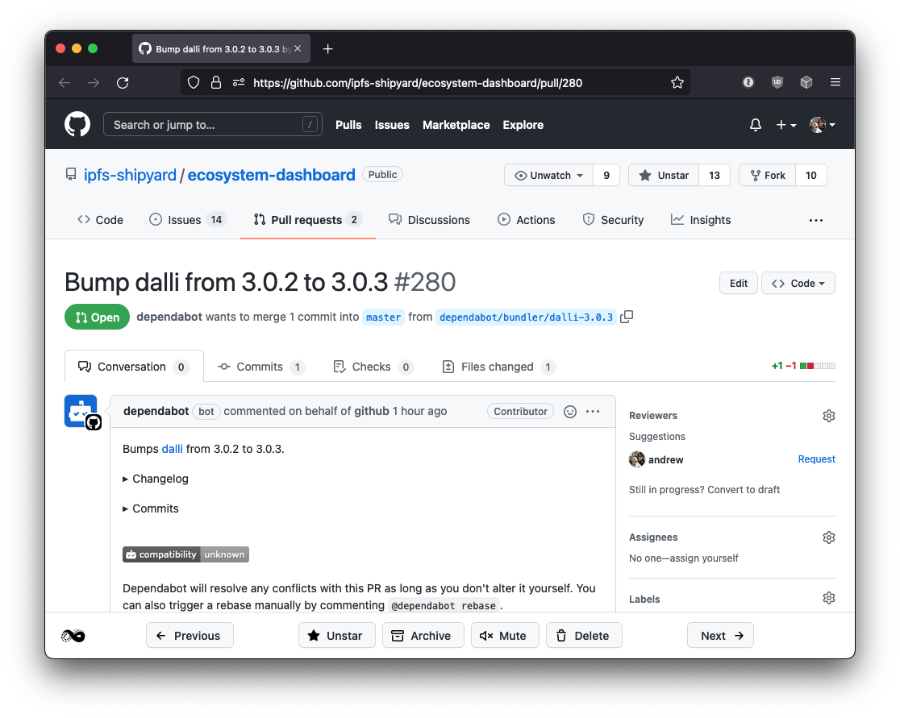

# Octobox Browser Extension

Integrate [Octobox](https://octobox.io) directly into your GitHub workflow with this browser extension.

Directly manage and triage through your Octobox inbox from your GitHub issues and pull requests. You can star, archive and mute notifications without needing to leave the page and quickly jump to the next and previous notifications in your inbox with a single click.

## Installation

You can currently install the browser extension from:
- The Firefox addon site: https://addons.mozilla.org/en-GB/firefox/addon/octobox/
- The Chrome webstore: https://chrome.google.com/webstore/detail/octobox/dpbajpnhgagfneijghelgldegjblinkc

The extension will be coming to the chrome and safari extension sites soon.

## Backers
Thank you to all our backers! 🙏 [[Become a backer](https://opencollective.com/octobox#backer)]

## Sponsors

Support this project by becoming a sponsor. Your logo will show up here with a link to your website. [[Become a sponsor](https://opencollective.com/octobox#sponsor)]

## Contribute

Please do! The source code is hosted at [GitHub](https://github.com/octobox/extension). If you want something, [open an issue](https://github.com/octobox/extension/issues/new) or a pull request.

If you need want to contribute but don't know where to start, take a look at the issues tagged as ["Help Wanted"](https://github.com/octobox/extension/issues?q=is%3Aopen+is%3Aissue+label%3A%22help+wanted%22).

You can also help triage issues. This can include reproducing bug reports, or asking for vital information such as version numbers or reproduction instructions. If you would like to start triaging issues, one easy way to get started is to [subscribe to Octobox on CodeTriage](https://www.codetriage.com/octobox/extension).

Finally, this is an open source project. If you would like to become a maintainer, we will consider adding you if you contribute frequently to the project. Feel free to ask.

For other updates, follow the project on Twitter: [@octoboxio](https://twitter.com/octoboxio).

### Note on Patches/Pull Requests

 * Fork the project.
 * Make your feature addition or bug fix.
 * Add tests for it. This is important so we don't break it in a future version unintentionally.
 * Send a pull request. Bonus points for topic branches.

### Vulnerability disclosure

We support and encourage security research on Octobox under the terms of our [vulnerability disclosure policy](https://github.com/octobox/octobox/blob/master/docs/VULNERABILITY_DISCLOSURE_POLICY.md).

### Code of Conduct

Please note that this project is released with a [Contributor Code of Conduct](https://github.com/octobox/octobox/blob/master/docs/CODE_OF_CONDUCT.md). By participating in this project you agree to abide by its terms.

## Copyright

[GNU Affero License](LICENSE.txt) © 2021 [Andrew Nesbitt](https://github.com/andrew).
